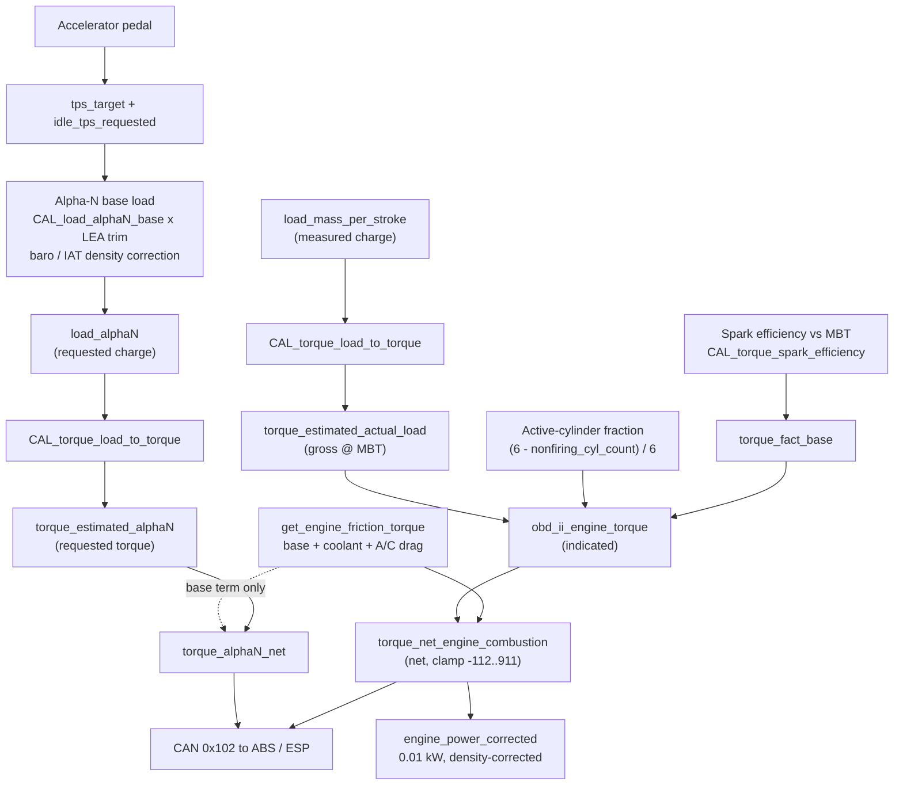
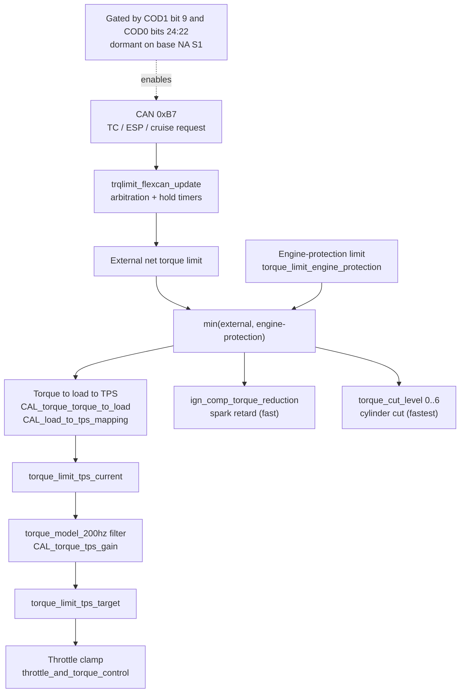

# Engine Torque Calculation — Series‑1 Lotus Evora (NA)

**ECU:** `B13200091` — 2011 Lotus Evora NA, US Federal, MPC5534, EFI Technology engine management.
**Source:** Ghidra disassembly `B13200091.c` (line numbers cited inline as `:NNNNN`).
**Scope:** combustion (indicated) torque, friction/drag, the ignition‑efficiency / spark‑retard torque model, engine power, the CAN torque broadcast, and the full torque‑limiter chain.

> The Evora torque model is **torque‑structured drive‑by‑wire**: the driver pedal becomes a throttle request, the ECU continuously *estimates* produced torque from air charge and spark, broadcasts it to the ABS/ESP, and — when a limiter is active — works backwards from a torque ceiling to a throttle angle (slow), a spark retard (fast), or a cylinder cut (fastest).

---

## 1. Execution context

| Function | Line | Role | Rate |
|---|---|---|---|
| `torque_model()` | `:51374` | Main torque estimation + limiter math | Periodic powertrain task (with `injection`, `ignition`, `vvt`, `knock`, `revlimit`) `:13685` |
| `get_engine_friction_torque()` | `:51888` | Friction/drag sub‑model | called by `torque_model` |
| `trqlimit_flexcan_update()` | `:51926` | Consolidates external (CAN) torque requests | called first in `torque_model` `:51407` |
| `torque_model_200hz()` | `:52310` | First‑order smoothing of the throttle limit + hold timers | 200 Hz task `:14295` (internal ÷2 → ~100 Hz) |
| `throttle_and_torque_control()` | `:43211` | Applies the throttle limit to the commanded throttle | throttle task |
| `ignition()` | `:~18326` | Applies the spark‑retard torque reduction per cylinder | crank‑synchronous |
| engine run‑state handler | `:16002` | Applies the **cylinder cut** (`torque_cut_level`) | engine‑position |
| `flexcan_a_tx_102()` | `:48536` | Broadcasts net torque to ABS/ESP (CAN `0x102`) | 10 Hz CAN tx |
| `overrev_gear_advisory_and_ips_coordination()` | `:~55620` | Computes `engine_power_corrected` | `:13686` |

---

## 2. Units & types

| Type | Meaning |
|---|---|
| `u16_torque_nm`, `u8_torque_nm` | Torque, **1 Nm / count** |
| `u8_torque_2nm` | Torque, **2 Nm / count** (load↔torque tables) |
| `u8_torque_4nm` | Torque, 4 Nm / count |
| `u16_power_1/100kw` | Power, **0.01 kW (10 W) / count** |
| `u8_load_4mg/stroke` | Cylinder charge, 4 mg/stroke / count |
| `u8_factor_1/255` | Fraction, `value/255` (0…1) |
| `u8_factor_1/100` | Fraction, `value/100` |
| `u8_factor_1/1023`, `u16_factor_1/1023` | Throttle / pedal position 0…1 |
| `i16_angle_1/4deg`, `u8_angle_1/4-64deg` | Spark angle, ¼° / count (latter with −64° bias) |

Internal **net torque saturates to roughly `[−112, +911]`** (`:51728‑51735`, `0xff90 = −112`, `911`); the `911`/`0x38f`(=911) value is used throughout as the "no limit / invalid" sentinel.

Sign convention: **friction lookups are stored positive and negated on use** (`torque_engine_friction_* = -(lookup)`), so all friction terms are negative Nm and *add* to combustion torque to give net.

---

## 3. Data‑flow overview

**Estimation & outputs** — air charge and spark advance become an estimated net torque, which is broadcast to the ABS/ESP and turned into a power figure:



**Limiters** — when a ceiling is active, the model works backwards from a torque limit to a throttle angle (slow), a spark retard (fast), or a cylinder cut (fastest):



---

## 4. Stage 1 — Load estimation (Alpha‑N) `:51408‑51447`

The NA Evora uses an **Alpha‑N** (engine‑speed × throttle) load model, density‑corrected, plus the actual measured charge.

**Requested (Alpha‑N) load:**
```
tps_combined = (tps_target + idle_tps_requested) >> 2        # 0..255, clamped       :51408
load_alphaN_base = CAL_load_alphaN_base[rpm, tps_combined] << 2                        :51413  (16×16, X=rpm Y=tps)
adj            = LEA_load_alphaN_adj[rpm, tps_combined]       # learned trim, /100     :51419
load_alphaN    = load_alphaN_base × adj/100
               × (baro / 1013)                               # manifold-pressure corr  :51423
               × (298 / (IAT_term + 233))                    # IAT density corr (Kelvin)
```
`load_alphaN` is the charge the **driver/throttle is requesting**.

**Actual load** is the separately‑measured `load_mass_per_stroke` (from the MAF/speed‑density front end, used directly).

Both are converted to torque by the same map **`CAL_torque_load_to_torque`** (256 = 16 rpm × 16 load, `u8_torque_2nm`):
```
torque_estimated_alphaN      = CAL_torque_load_to_torque[rpm, load_alphaN>>2]   << 1   :51428  (requested)
torque_estimated_actual_load = CAL_torque_load_to_torque[rpm, load_mass_per_stroke] <<1 :51442 (produced, gross/indicated @ MBT)
```

---

## 5. Stage 2 — Indicated combustion torque `:51507‑51726`

The gross/indicated torque is the **actual‑load torque scaled by spark efficiency and by the number of firing cylinders**.

### 5.1 Spark‑efficiency factor (`torque_fact_base`, 0…255)
```
torque_fact_base_speed_and_load = CAL_torque_factor_base_engine_speed_load[rpm, load] - 52      :51507  (16×16)
spark_retard_from_mbt = ign_mbt_modeled - average(applied advance over active cyls)  :51669
torque_spark_eff_current = CAL_torque_spark_efficiency[rpm, spark_retard_from_mbt]       :51682  (16×16, Y=spark-from-MBT)
torque_fact_base = clamp( fact - (255-fact)·(speed_load_base-52)·/26 , 0, 255 )                 :51688‑51701
```
`CAL_torque_spark_efficiency` is the **fraction of MBT torque produced at a given spark retard** — the core "spark → torque" relationship. `nonfiring_cyl_count` (`:51630‑51666`) starts at 6 and is decremented once per firing cylinder (enabled, no coil fault, not cut), so it holds the **non‑firing** cylinder count; `(6 - nonfiring_cyl_count)` = active cylinders, and `ign_adv_sum_firing_cyl` sums those firing cylinders' applied advance (averaged to form `spark_retard_from_mbt`).

### 5.2 Indicated torque
```
obd_ii_engine_torque = torque_fact_base × ( torque_estimated_actual_load × (6 - nonfiring_cyl_count)/6 ) / 255   :51717
                     = 0   if fuel is cut or per-cylinder fire disabled (inj_flags.0 / ign_per_cyl_fire_enable)  :51716,:51724
```
This is exposed as the OBD engine‑torque value and is the **gross/indicated** combustion torque (before friction).

---

## 6. Stage 3 — Friction / drag torque  `get_engine_friction_torque()` `:51888`

```
torque_engine_friction_base      = -CAL_torque_engine_friction_speed_component[rpm, speed]     :51893  (16×16, base pumping+mechanical)
torque_engine_friction_coolant   = -CAL_torque_engine_friction_temp_component[coolant, load]   :51899  (8×8, cold-engine extra friction)
torque_engine_friction_accessory = -CAL_torque_engine_ac_load_base[ac_compressor_load/40]                 :51905  (A/C compressor parasitic load)
torque_engine_friction_comp_engine_speed = CAL_torque_engine_ac_load_scaler[rpm]               :51909  (RPM scaler for accessory load)
torque_engine_friction_total     = accessory × comp_engine_speed / 255                          :51913
return  engine_friction_torque = coolant + total(accessory) + base        # all ≤ 0, total drag :51920
```
The accessory term is driven by the **A/C compressor load** (`ac_compressor_load`, see the A/C analysis) divided by 40, so commanded A/C load directly increases booked engine drag and the idle‑up.

---

## 7. Stage 4 — Net torque & the two CAN signals `:51727‑51881`, `flexcan_a_tx_102 :48536`

```
torque_calc_net = obd_ii_engine_torque + engine_friction_torque          # NET (brake) torque   :51727
                  clamp to [-112, 911]                                                            :51728
torque_net_engine_combustion = torque_calc_net                                                    :51881

torque_alphaN_net = torque_estimated_alphaN + torque_engine_friction_base   # requested net       :51738
                    (0 while in the engine_operating_state_flags.0 condition)
```

**CAN `0x102` → ABS/ESP** (`arb_id 0x4080000>>18 = 0x102`, mailbox `fca_buffer[0x15]`):
| Field | Source | Encoding |
|---|---|---|
| Alpha‑N net torque (12‑bit, unsigned) | `torque_alphaN_net` clamped ≥0 | Nm, `0xFFF` = invalid `:48549` |
| Combustion net torque (11‑bit, signed) | `torque_net_engine_combustion` | `(T − 400)·4` → offset 400 Nm, **0.25 Nm** res, `0x7FF` = invalid `:48559` |

Invalidated to `0xFFF/0x7FF` on MAF/crank faults, 6‑cylinder misfire, etc. `:48547‑48569`.
`torque_net_engine_combustion` is also returned by OBD Mode 0x22 (`:32714`).

- **`torque_alphaN_net`** = the *available / driver‑requested* net torque (throttle‑implied), used by ABS/ESP as driver demand.
- **`torque_net_engine_combustion`** = the *actual* net torque currently produced.

---

## 8. Stage 5 — Engine power output  `:55670‑55687`

Computed inside the slip / gear‑advisory module, in **0.01 kW** (`u16_power_1/100kw`):
```
T = clamp(torque_net_engine_combustion, 0, 3276)
raw = engine_speed_2 × T × 10                        # ∝ RPM·Nm
engine_power_corrected = (raw / 955)                 # P[W]/10  (955 ≈ 60/(2π)·... → 0.01 kW units)
                       × (1013 / baro)               # pressure correction to reference
                       × ((IAT_term + 233) / 298)    # temperature correction (Kelvin)
```
`engine_power_corrected` is **brake power normalized to reference atmospheric conditions (1013 mbar, ~298 K)**. Its consumer is `CAL_slip_power_based_rpm_thresholds` (`:55712`) — a **power‑based over‑rev / gear‑detection threshold** for the slip/gear advisory and IPS coordination. It is not used for closed‑loop torque control; it is the only explicit "engine power" quantity in the firmware.

---

## 9. Stage 6 — Ignition‑based torque reduction (spark retard) `:51514‑51628`, applied `:18326‑18399`

When a torque limit demands a reduction faster than the throttle can deliver, the model converts the demanded reduction factor into a **spark retard command**:

```
torque_reduction_factor_ign = f(torque_reduction_factor, torque_fact_base_speed_and_load)         :51514
_torque_limit_ign_base = CAL_torque_ign_retard_base[rpm, torque_reduction_factor_ign]              :51613 (16×16, ¼°−64 bias)
ign_comp_torque_reduction = ign_retard_knock_avg + (_torque_limit_ign_base + (MBT-base delta) - 255 - ign_comp_total)
ign_comp_torque_reduction = min(0, …)        # it is a retard (≤ 0)                                  :51618‑51628
```
`ign_retard_knock_avg` folds in the current knock retard so the two retard sources don't double‑count.

**Application in `ignition()`** (only when `COD[0][24:22] != 0`, i.e. torque intervention coded):
```
ign_adv_final = ign_comp_torque_reduction + ign_adv_target1 + ign_adv_from_roughness + ign_comp_total   :18330,:18352
if (ign_adv_final < ign_adv_min && ign_comp_torque_reduction < 0) ign_adv_final = ign_adv_min            (floored)
```
Per cylinder, the retard headroom is tracked in `ign_torque_retard_margin_per_cyl[6]` / `ign_adv_with_torque_retard[6]` (`:18386‑18524`) and **ramped back out** by `ign_retard_recovery_step` (`:18574`) once the demand clears. If `COD[0][24:22]==0`, this whole spark‑torque path is bypassed (`ign_adv_final` excludes `ign_comp_torque_reduction`).

The reverse direction — how much torque the *current* spark retard is costing — is `torque_loss_from_ign_retard` (`:51784‑51814`), used to size the engine‑protection ceiling.

---

## 10. Stage 7 — Torque limiters

### 10.1 External requests — CAN `0xB7` `:46659‑46766`, `trqlimit_flexcan_update :51926`
Received on FlexCAN A (`fca_buffer[0]`), **gated by `COD[1].9 == 1` AND `COD[0][24:22] != 0`** (`:46659`). Three sub‑requests decoded as `(raw>>2)+400` (offset 400 Nm, 0.25 Nm):
| Signal | Meaning |
|---|---|
| `torque_limit_external_tc_fast` | Traction‑control fast request |
| `torque_limit_external_esp_fast` | ESP fast request |
| `torque_limit_external_tc_slow` | Traction‑control slow request |
plus flags `torque_req_0xb7_abs_esp_active`, `torque_req_0xb7_cruise_control_active`, `tc_torque_limit_use_slow_path`.

`trqlimit_flexcan_update()` arbitrates these (priority cruise → ESP → TC, with hold counter `CAL_torque_ext_torque_limit_hold_count`, IPS‑shift coordination) into the working external targets, finally producing `u16_torque_nm_400014c2` and `torque_limit_tps2` (`:52212‑52239`). When no source is active they default to **911 (no limit)**.

### 10.2 Engine‑protection limit `:51455‑51822`
```
external_net   = u16_torque_nm_400014c2 - friction        clamp [0,510]                 :51744
torque_limit_external_and_internal = min(external_request_final, torque_limit_engine_protection)  :51468
torque_limit_engine_protection = (driver_net_clamped + torque_loss_from_ign_retard) × 6/(6-failed_cyl)  clamp ≤510  :51816
```
`CAL_torque_external_request_minimum` (`:51459`) sets a floor under the external request so a limiter cannot command less than a calibrated minimum.

### 10.3 Throttle‑based application (slow path) `:51472‑51505`, `:52365‑52385`, `:43241‑43266`
The torque ceiling is converted **back to a throttle angle**:
```
load_from_torque_limit5 = CAL_torque_torque_to_load[rpm, torque_limit]  × baro/IAT correction   clamp ≤1023   :51473
torque_to_tps_cal       = CAL_load_to_tps_mapping[rpm, load]                                                    :51486
tps_trqmodel_factor2    = LEA_torque_torque_to_tps_scaling[rpm, load]   # learned, /100                         :51492
torque_limit_tps_current = torque_to_tps_cal × tps_trqmodel_factor2 / 100                                       :51500
```
`torque_model_200hz()` low‑pass‑filters `torque_limit_tps_current → torque_limit_tps_target` (gain `CAL_torque_tps_gain`, `:52372`), and `throttle_and_torque_control()` clamps the commanded throttle to it when `torque_limit_tps_target < 1024` and a source is active (`:43241`). `LEA_torque_torque_to_tps_scaling` is **adaptively learned** within `CAL_torque_torque_to_tps_scaling_rpm_range` (`:14387`).

### 10.4 Cylinder cut (fast/coarse) `:51825‑51882`, applied `:16002‑16060`
`torque_cut_level` (0…6 = number of cylinders to drop) is derived from the gap between `torque_limit_external_factor` and `torque_limit_base_factor` in steps of `constant_42 = 42` (≈ 255/6 per cylinder). Application disables `ign_cyl_enabled[]` on the correct cylinders (spread evenly, accounting for already‑failed/coil‑fault cylinders); **level 6 = all cylinders cut**.

### 10.5 The unifying reduction factor
`torque_reduction_factor` (`u8_factor_1/255`, `:51860‑51878`) is the single demanded‑reduction handle: `torque_limit_external_factor = external_net / torque_estimated_actual_load` (`:51762`), then combined with the cylinder‑cut count. Throttle handles the steady‑state bulk; spark retard + cylinder cut cover fast transients.

### 10.6 Other throttle clamps (`throttle_and_torque_control` `:43269‑43308`)
Not part of the torque model proper but they cap commanded throttle: TPS fault (`CAL_tps_commanded_during_fault`), single/multi‑cylinder misfire (`CAL_tps_limit_severe_misfire_*`, `CAL_tps_limit_misfire_single_bank`), warm‑up (`tps_max_during_warmup`), idle‑request max, limp/LFB (`lfb_tps_max`), and a brake + wheel‑deceleration safety floor.

### 10.7 Rev limiter (adjacent)
`revlimit()` (`:53968`, called right after `torque_model`) is a **separate engine‑speed limiter** (per‑gear trim, speed‑limit governor, fuel/spark cut) — it is not part of the torque estimation but shares the throttle path.

---

## 11. Coding gates & S1‑vs‑S2 behaviour

| Gate | Controls | NA S1 (`B13200091`) |
|---|---|---|
| `COD[1] bit 9` | Accept ABS/ESP/TC torque requests (CAN 0xB7) | Typically **0** (no ECU‑based TC fitted) |
| `COD[0] bits[24:22]` (`>>0x16 & 7`) | Torque intervention variant; enables spark torque‑reduction and external limit | `0` ⇒ disabled |

**Always active on the NA S1:** load estimation, indicated/net combustion torque, friction sub‑model, `torque_alphaN_net` / `torque_net_engine_combustion`, the CAN `0x102` broadcast, `engine_power_corrected`, the engine‑protection clamp, and the misfire/warm‑up/fault/rev‑limit throttle clamps.

**Coding‑gated (dormant unless coded — the S2 GT430 ECU‑TC, 400/GT cars):** the CAN `0xB7` external TC/ESP/cruise torque limit, the spark‑retard torque reduction (`ign_comp_torque_reduction`), and the torque‑driven cylinder cut for *external* limiting. (Cylinder cut still occurs for `failed_ignition_cyl_count`/misfire handling.)

This matches the project note that the S2 cars carry the torque‑limit calibrations while the NA S1 is the simplest variant.

---

## 12. Calibration table reference

| Table | Dims / axes | Type | Role |
|---|---|---|---|
| `CAL_load_alphaN_base` | 16×16, rpm × tps | u8 | Alpha‑N base charge |
| `LEA_load_alphaN_adj` (+`_X_rpm`,`_Y_tps`) | 16×16 | u8 `/100` | Learned Alpha‑N trim |
| `CAL_torque_load_to_torque` | 16×16, rpm × load | `u8_torque_2nm` | Charge → torque |
| `CAL_torque_torque_to_load` | 16×16, rpm × torque | `u8_load_4mg` | Torque → charge (limiter inverse) |
| `CAL_torque_factor_base_engine_speed_load` | 16×16, rpm × load | u8 | Base torque factor (−52 bias) |
| `CAL_torque_spark_efficiency` (`_X_engine_speed`, `_Y_spark_retard_from_mbt`) | 16×16, rpm × spark‑from‑MBT | u8 | **Spark → torque fraction** |
| `CAL_torque_ign_retard_base` | 16×16, rpm × reduction‑factor | `u8_angle_¼°−64` | Reduction → spark retard |
| `CAL_torque_engine_friction_speed_component` | 16×16, rpm × speed | `u8_torque_nm` | Base friction |
| `CAL_torque_engine_friction_temp_component` | 8×8, coolant × load | `u8_torque_nm` | Cold‑engine friction |
| `CAL_torque_engine_ac_load_base` | 16, AC‑load | u8 | A/C accessory drag |
| `CAL_torque_engine_ac_load_scaler` | 8, rpm | `u8_factor_1/255` | A/C drag rpm scaler |
| `CAL_torque_limit_base_factor` | 16×16, rpm × load | `u8_factor_1/255` | Limiter base factor |
| `CAL_torque_external_request_minimum` | 16×16, rpm × torque | u8 | Floor under external request |
| `CAL_load_to_tps_mapping` | rpm × load | u8 | Load → throttle |
| `LEA_torque_torque_to_tps_scaling` | 16×16, rpm × load | `u8_factor_1/100` | Learned torque→TPS scaling |
| `CAL_torque_torque_to_tps_scaling_rpm_range` | 2 | rpm | Learn‑enable window |
| `CAL_torque_tps_gain` | scalar | `u8_factor_1/255` | 200 Hz throttle‑limit filter gain |
| `CAL_torque_hysteresis_threshold1` | scalar | `u8_torque_nm` | Cruise torque ramp step |
| `CAL_torque_ext_torque_limit_hold_count` | scalar | count | External‑request hold time |
| `CAL_slip_power_based_rpm_thresholds` (+`_X_power`) | 8 | rpm/power | Over‑rev threshold vs power |

## 13. Key runtime variables

| Variable | Meaning |
|---|---|
| `load_alphaN`, `load_mass_per_stroke` | Requested (Alpha‑N) vs measured cylinder charge |
| `torque_estimated_alphaN` / `torque_estimated_actual_load` | Torque from requested vs measured charge (gross @ MBT) |
| `torque_fact_base` | Spark‑efficiency factor (0…255 = fraction of MBT) |
| `nonfiring_cyl_count` | `6 − active_firing_cylinders` |
| `obd_ii_engine_torque` | Indicated combustion torque (gross) |
| `engine_friction_torque` (+ `_base/_coolant/_accessory/_total`) | Friction/drag (≤0) |
| `torque_net_engine_combustion` | Net (brake) torque → CAN 0x102 |
| `torque_alphaN_net` | Requested net torque → CAN 0x102 |
| `engine_power_corrected` | Brake power, 0.01 kW, density‑corrected |
| `ign_comp_torque_reduction` | Commanded spark retard for torque limiting (≤0) |
| `torque_loss_from_ign_retard` | Torque currently lost to spark retard |
| `torque_reduction_factor` / `_ign` | Demanded reduction handle (overall / spark) |
| `torque_limit_engine_protection` | Internal max torque |
| `torque_limit_external_net` / `_factor` | External (TC/ESP) limit in net Nm / as factor |
| `torque_limit_tps_current` → `torque_limit_tps_target` | Limiter throttle angle (raw → filtered) |
| `torque_cut_level` (`ign_cyl_enabled[]`) | Cylinders cut for torque reduction (0…6) |
| `torque_limit_source_flags` | Bitfield: which limiter(s) active |
| `spark_retard_from_mbt` | Average spark retard below MBT (¼°); indexes the spark‑efficiency table |
| `ign_adv_sum_firing_cyl` | Sum of applied advance over firing cylinders (¼°); ÷ firing count → `spark_retard_from_mbt` |
| `torque_spark_eff_current` / `torque_spark_eff_at_limit` | `CAL_torque_spark_efficiency` lookup at the actual vs limit‑scenario spark retard |
| `ac_compressor_load` | Current applied A/C compressor load; ÷40 indexes the accessory‑drag and idle‑up tables |

---

## 14. Caveats / open items

- Net‑torque values are in `u16_torque_nm` (1 Nm) per the typedefs, but the model carries gross/indicated headroom (saturates `[-112, 911]`); treat as model Nm, not a dyno figure. The CAN combustion field is the authoritative externally‑scaled value (offset 400, 0.25 Nm).
- Several limiter intermediates (`u16_torque_nm_400014c2`, `torque_limit_tps2`, `…_400014e8/ea/ec/ee/f2/f4/f6`) are "fast/slow/secondary" channels of the external request arbitration; this document treats them collectively as the **external torque limit** rather than enumerating every temporary.
- The magic constants in the density corrections (`1013`, `233`, `298`, `0xfd4`, `955`) implement standard pressure/Kelvin normalization; exact rounding follows the integer code.
- Whether `COD[1].9` / `COD[0][24:22]` are actually set on a given NA S1 car should be confirmed against that car's coding before assuming the external‑limit/spark‑intervention paths are live.

**Naming.** Several symbols were renamed from the Ghidra auto‑names for clarity: `CAL_torque_factor_base_ign_intervention` → `CAL_torque_spark_efficiency` (+ `_Y_ign_adv` → `_Y_spark_retard_from_mbt`), `trqlimit_intervention_level` → `nonfiring_cyl_count`, `i16_angle_1_4deg_40002406` → `ign_adv_sum_firing_cyl`, `torque_ign_adv_from_intervention` → `spark_retard_from_mbt`, `torque_fact_base_ign_intervention` → `torque_spark_eff_current`, `torque_factor_ign_intervention` → `torque_spark_eff_at_limit`, and `DAT_4000241c` → `ac_compressor_load`. Older `.c` snapshots will show the original auto‑generated names.

*Generated from static analysis of `B13200091.c`; line numbers refer to that file.*
